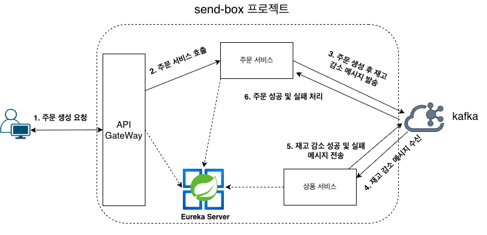

# Send-Box 프로젝트
- 카프카, 스프링 클라우드 MSA 아키텍처를 사용해서 주문 생성, 상품 재고 감소 기능을 구현했습니다.

## 기술 스택

### 백엔드
- Java 17
- SpringBoot 3.4.1
- JPA (Spring Data JPA, QueryDSL)
- MySql 8.0.32
- Docker
- Kafka

### 개발 도구
- IntelliJ IDEA

## 프로젝트 구조 이미지


### 테이블

#### 상품(product) 테이블 (상품 정보 관리)
|컬럼명|데이터 타입|제약 조건|설명|
|---|---|---|---|
|product_id|BIGINT|PK, AUTO_INCREMENT|상품 식별자|
|category|VARCHAR(50)|NOT NULL|상품 카테고리{RAMEN, SNACK, DRINK, SOUP}|
|name|VARCHAR(255)|NOT NULL, UNIQUE|상품의 이름|
|price|INT|NOT NULL|상품의 가격|
|stock_quantity|INT|NOT NULL|상품의 재고|

#### 주문(orders) 테이블 (주문 내역 기록)
|컬럼명|데이터 타입|제약 조건|설명|
|---|---|---|---|
|orders_id|BIGINT|PK, AUTO_INCREMENT|주문 식별자|
|user_id|BIGINT|NOT NULL|주문한 고객의 ID|
|status|VARCHAR(45)|NOT NULL|주문 상태{PENDING(대기), COMPLETED(완료), FAILED(실패), CANCEL(취소)}|
|order_date_time|DATETIME|NOT NULL|주문 생성 일시|

#### 주문 아이템(orders_item) 테이블 (주문 상품 상세 내역 기록)
|컬럼명|데이터 타입|제약 조건|설명|
|---|---|---|---|
|orders_item_id|BIGINT|PK, AUTO_INCREMENT|주문 아이템 식별자|
|orders_id|BIGINT|NOT NULL|주문 식별자|
|product_id|BIGINT|NOT NULL|상품 식별자|
|product_name|VARCHAR(255)|NOT NULL|주문한 상품의 이름|
|price|INT|NOT NULL|주문한 상품의 가격|
|quantity|INT|NOT NULL|주문 수량|

#### 주문 실패 기록(orders_fail_log) 테이블 (주문 실패에 대한 내역 기록)
|컬럼명|데이터 타입|제약 조건|설명|
|---|---|---|---|
|orders_fail_log_id|INT|PK, AUTO_INCREMNT|주문 실패 식별자|
|orders_id|BIGINT|NOT NULL|주문 식별자|
|fail_message|VARCHAR(255)|NOT NULL|주문 실패에 대한 메시지|
|created_time|DATETIME|NOT NULL|주문 실패 생성 일시|

### 주요 기능 코드
```java

package com.example.ordering.service;

@RequiredArgsConstructor
@Transactional
@Service
public class OrdersService {

    private final OrdersRepository ordersRepository;
    private final KafkaTemplate<String, Object> kafkaTemplate;
    private final OrdersEventMapper ordersEventMapper; // 유틸 클래스

    //데이터 정합성, 주문 데이터에 대한 Validation 생략
    public void createOrders(OrdersReqDto ordersReqDto, String userId) {
        List<OrdersItem> ordersItems = ordersReqDto.toOrdersItems(); // 1. 주문 생성
        Orders orders = ordersRepository.save(new Orders(Long.valueOf(userId), ordersItems)); // 2. 주문 저장
        OrdersCreateMessage message = ordersEventMapper.toOrdersCreateEvent(orders.getId(), ordersReqDto); // 3. 이벤트 메시지 생성
        kafkaTemplate.send("ordering.orders-created", message); // 4. 카프카 메시지 발행
    }
}

package com.example.ordering.listener;

@Slf4j
@RequiredArgsConstructor
@Transactional
@Service
public class OrdersListener {

    private final OrdersRepository ordersRepository;
    private final OrdersFailLogRepository ordersFailLogRepository;
    private final ObjectMapper objectMapper;

    @KafkaListener(topics = "ordering.orders-completed", groupId = "ordering.orders-completed.consumer", concurrency = "2")
    public void handleOrdersCompleteEvent(String message) throws JsonProcessingException {
        log.info("Received OrdersCompleteEvent {}", message);
        OrdersCompleteMessage ordersCompleteMessage = objectMapper.readValue(message, OrdersCompleteMessage.class);
        OrdersCompleteEvent payload = ordersCompleteMessage.getPayload();
        Orders orders = ordersRepository.findById(Long.valueOf(payload.getOrderId()))
                .orElseThrow(EntityNotFoundException::new);
        orders.complete();
    }

    @KafkaListener(topics = "ordering.orders-failed", groupId = "ordering.orders-failed.consumer", concurrency = "2")
    public void handleOrdersFailEvent(String message) throws JsonProcessingException {
        log.info("Received OrdersFailEvent {}", message);
        OrdersFailMessage ordersFailMessage = objectMapper.readValue(message, OrdersFailMessage.class);
        OrdersFailEvent payload = ordersFailMessage.getPayload();
        Orders orders = ordersRepository.findById(Long.valueOf(payload.getOrderId()))
                .orElseThrow(EntityNotFoundException::new);
        orders.fail();
        OrdersFailLog ordersFailLog = new OrdersFailLog(Long.valueOf(payload.getOrderId()), payload.getFailMessage());
        ordersFailLogRepository.save(ordersFailLog);
    }
}

package com.example.product.listener;

@Slf4j
@RequiredArgsConstructor
@Transactional
@Service
public class OrdersEventListener {

    private final ProductRepository productRepository;
    private final KafkaTemplate<String, Object> kafkaTemplate;
    private final ObjectMapper objectMapper;

    //여러 예외 상황에 대한 처리는 생략
    @KafkaListener(
            topics = "ordering.orders-created",
            groupId = "ordering.orders-created.consumer",
            concurrency = "2")
    public void handleOrdersCreatedEvent(String message) throws JsonProcessingException {
        log.info("Received Orders Created message: {}", message);
        OrdersCreateMessage ordersCreateMessage = objectMapper.readValue(message, OrdersCreateMessage.class);
        OrdersCreateEvent ordersCreateEvent = ordersCreateMessage.getPayload();
        try {
            List<Long> productIds = ordersCreateEvent.getProductIds();
            Map<Long, Product> productMap = productRepository.findAllById(productIds)
                    .stream()
                    .collect(Collectors.toMap(Product::getId, product -> product));

            for (OrdersCreateEvent.OrderItem orderItem : ordersCreateEvent.getOrderItems()) {
                Product product = productMap.get(Long.valueOf(orderItem.getProductId()));
                product.decreaseStockQuantity(orderItem.getQuantity()); // Product 엔티티의 재고 감소 메서드 호출
            }

            // 재고 감소 처리 완료시 주문 성공 메시지를 카프카로 전송
            OrdersCompleteEvent ordersCompleteEvent = new OrdersCompleteEvent(ordersCreateEvent.getOrderId());
            kafkaTemplate.send("ordering.orders-completed", new OrdersCompleteMessage(ordersCompleteEvent));
        } catch (CustomException ce) {
            // 재고 감소 처리중 예외가 발생하면 트랜잭션을 롤백하고, 주문 실패 메시지를 카프카로 전송
            OrdersFailEvent ordersFailEvent = new OrdersFailEvent(ordersCreateEvent.getOrderId(), ce.getMessage());
            kafkaTemplate.send("ordering.orders-failed", new OrdersFailMessage(ordersFailEvent));
            throw ce;
        } catch (Exception e) {
            log.error("Error occurred while processing Orders Created message : {}", e.getMessage());
            throw e;
        }
    }
}
```
